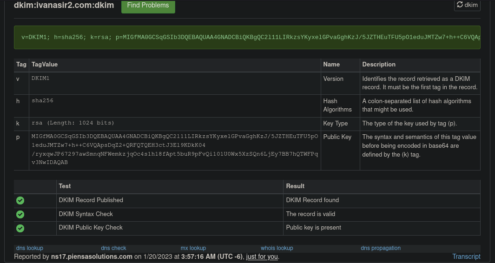
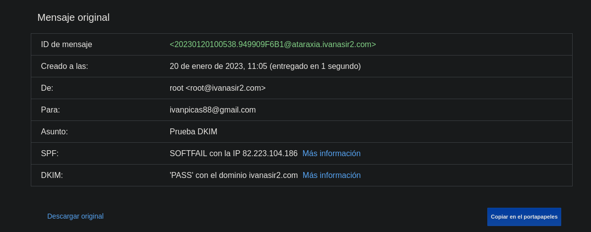
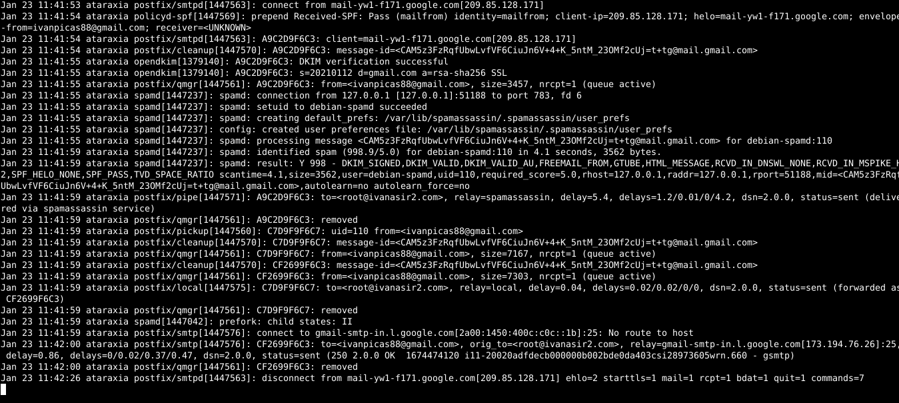
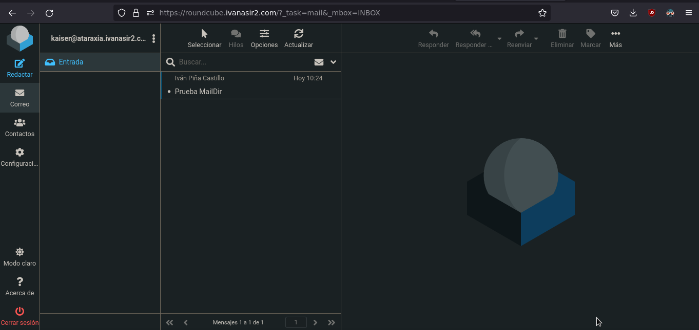

# Instalación y configuración de un Servidor de Correos en la VPS

    Instala y configura de manera adecuada el servidor de correos en tu VPS. El nombre del servidor de correo será mail.tudominio.es (Este es el nombre que deberá aparecer en el registro MX).

## Gestión de correos desde el servidor

    El envío y recepción se hará desde el servidor usando la herramienta mail.

## Tarea 1

### Documenta una prueba de funcionamiento, donde envíes desde tu servidor local al exterior. Muestra el log donde se vea el envío. Muestra el correo que has recibido. Muestra el registro SPF.

He entrado en la configuración DNS de mi hosting para agregar el registro MX necesario, así como el registro SPF. 


También he habilitado el puerto 25 en el firewall de la VPS.


Después he instalado postfix y los paquetes necesarios para enviar correos:
```bash
apt install postfix bsd-mailx
```

Ya con la IP pública no necesitamos añadir el relay a la configuración de postfix. Así que procedí a enviar un correo a mi cuenta de Gmail y comprobé que se había enviado correctamente mirando los logs.


```bash
tail -f /var/log/mail.log
```


Finalmente verifiqué que el correo se había recibido en mi cliente de correo.


## Tarea 2

### Documenta una prueba de funcionamiento, donde envíes un correo desde el exterior (gmail, hotmail,…) a tu servidor local. Muestra el log donde se vea el envío. Muestra cómo has leído el correo. Muestra el registro MX de tu dominio.

Vamos a enviar un correo desde mi cliente de correo electrónico de Gmail hacia mi VPS:


Como mostramos en nuestra tarea anterior, hay un registro de tipo MX en el registro DNS de mi VPS que apunta hacia mi máquina, por lo que debería ser capaz de recibir el correo sin ningún tipo de problema. Veamos los logs de la VPS para ver si el correo ha llegado.


En los logs se muestra la recepción del correo. Para verlo, usaremos la herramienta mail. Una vez abierta, vemos el correo que hemos enviado desde nuestro cliente de Gmail.


## Uso de alias y redirecciones

## Tarea 3

### Vamos a comprobar como los procesos del servidor pueden mandar correos para informar sobre su estado. Por ejemplo cada vez que se ejecuta una tarea cron podemos enviar un correo informando del resultado. Normalmente estos correos se mandan al usuario root del servidor, para ello:
```bash
$ crontab -e
```

E indico donde se envía el correo:
```bash
MAILTO = root
```

Puedes poner alguna tarea en el cron para ver como se mandan correo.

Posteriormente usando alias y redirecciones podemos hacer llegar esos correos a nuestro correo personal.

Configura el cron para enviar correo al usuario root. Comprueba que están llegando esos correos al root. Crea un nuevo alias para que se manden a un usuario sin privilegios. Comprueban que llegan a ese usuario. Por último crea una redirección para enviar esos correo a tu correo personal (gmail,hotmail,…).

Para empezar, he creado una tarea cron que se ejecuta cada 3 minutos y he hecho que mande el mail al usuario “root”.


El script que ejecuta es el siguiente:
```bash
#! /bin/sh

echo "Correo para informar sobre el estado. La tarea Cron funciona."
```

Es un script muy simple que servirá para realizar las pruebas que necesitemos. 


A continuación, he creado un alias en el fichero /etc/aliases para que los correos que lleguen al usuario “root” sean reenviados a mi usuario “kaiser”:
```bash
nano /etc/aliases
```


Para que se apliquen los cambios realizados en este fichero debemos ejecutar el siguiente comando:
```bash
newaliases
```

Ahora los correos que le lleguen al usuario “root”, deberían llegarle también al usuario “kaiser”:


Finalmente, he creado un fichero .forward en el directorio ~ del usuario, en el que he añadido la cuenta a la que quiero reenviar los mensajes:
```bash
nano ~/.forward

ivanpicas88@gmail.com
```

Ahora, los correos que lleguen al usuario “root”, se reenviarán también a mi usuario “kaiser” y, a su vez, a mi cuenta principal de correo:


## Para asegurar el envío

## Tarea 4

### Configura de manera adecuada DKIM es tu sistema de correos. Comprueba el registro DKIM en la página https://mxtoolbox.com/dkim.aspx. Configura postfix para que firme los correos que envía. Manda un correo y comprueba la verificación de las firmas en ellos.

En esta tarea, configuraremos DKIM (DomainKeys Identified Mail) en nuestra VPS como un método de autenticación para los correos que enviamos. Esto garantiza que el mensaje no ha sido modificado desde que fue enviado. Básicamente, publicamos la clave pública del servidor de correos en el registro TXT del DNS. Así, el servidor firmará los mensajes con la clave pública y los clientes usarán la clave pública en el DNS para verificar la firma.

Explicado esto, vamos a instalar los paquetes necesarios para configurar DKIM en nuestra vps:
```bash
apt install opendkim opendkim-tools
```

Ahora modificaremos el fichero de configuración de DKIM (/etc/opendkim.conf):
```bash
nano /etc/opendkim.conf
```
```conf
Syslog                  yes
SyslogSuccess           yes
Canonicalization        relaxed/simple
OversignHeaders         From
Domain                  ivanasir2.com
Selector                dkim
KeyFile         		/etc/dkimkeys/dkim.private
UserID                  opendkim
UMask                   007
Socket                  inet:8891@localhost
PidFile                 /run/opendkim/opendkim.pid
TrustAnchorFile         /usr/share/dns/root.key
```
De los parámetros anteriores he dejado por defecto la mayoría. Los que he cambiado son los siguientes:

    Domain: Indicamos nuestro dominio.
    Selector: Nombre único, el cual utilizaremos más tarde para subir la clave pública al servidor dns y para que el destinatario pueda identificarla fácilmente.
    KeyFile: Localización de la clave privada, la cual usaremos para firmar los mensajes.
    Socket: Cambiamos el socker UNIX que viene por defecto por uno TCP/IP (comentamos el que venía por defecto y descomentamos este).

Como hemos cambiado el socket, debemos modificar el fichero /etc/default/opendkim para indicarlo:
```bash
nano /etc/default/opendkim

SOCKET=inet:8891@localhost
```
Ahora vamos a tener que modificar el fichero de configuración de Postfix (/etc/postfix/main.cf) para indicarle que use este mecanismo para firmar los mensajes:
```bash
nano /etc/postfix/main.cf
```
```conf
milter_default_action = accept
milter_protocol = 2
smtpd_milters = inet:localhost:8891
non_smtpd_milters = $smtpd_milters
```

Nos encontramos ahora en el directorio que mencionamos previamente (/etc/dkimkeys) y ejecutaremos un comando para generar el par de claves. Este comando nos ayudará a generar una clave privada y una clave pública que se utilizarán para autenticar nuestros correos electrónicos:
```bash
opendkim-genkey -s dkim -d ivanasir2.com -b 1024
```

Donde:

    “-s:” Indicamos el “Selector” al cual nombramos en la configuración de DKIM.
    “-d:” Indicamos el dominio.
    “-b:” Indicamos el tamaño de la clave.

Al par de claves que se han generado debemos cambiarle el propietario:
```bash
chown opendkim: dkim.private dkim.txt
```

Ahora ya solo tendríamos que añadir el registro TXT al dns en el cual indicaremos la clave pública. El registro debe comenzar por lo siguiente: [selector]._domainkey. Así pues, mi registro quedaría de la siguiente forma:


Si usamos la herramienta que se menciona en el enunciado, podemos comprobar que el registro se ha añadido correctamente:



Sin embargo, esto solo nos indica que el registro se ha añadido de forma correcta, no que nuestro servidor sea capaz de firmar los mensajes con nuestra clave privada. Para comprobar esto, lo primero que hay que hacer es reiniciar los servicios de postfix y opendkim. Una vez hecho esto, se puede enviar un mensaje y comprobar si se ha firmado correctamente. Si esto se ha hecho correctamente, entonces se puede estar seguro de que nuestro servidor puede firmar los mensajes con la clave privada:
```bash
systemctl restart opendkim postfix
```

Comprobemos si nuestra vps está escuchando en el puerto que le hemos indicado (8891):
```bash
netstat -tlnp | egrep opendkim
```


Ahora mandaremos un mensaje a mi cuenta de gmail y veremos si nos indica que está verificado por dkim:


Veamos el mensaje:


Y el contenido original del mensaje:



## Para luchar contra el SPAM

## Tarea 5

### Configura de manera adecuada Postfix para que tenga en cuenta el registro SPF de los correos que recibe. Muestra el log del correo para comprobar que se está haciendo el testeo del registro SPF.

Para que postfix pueda comprobar los registros SPF de los correo que le llegan, debemos instalar otro paquete que le agregue esa funcionalidad, ya que no la tiene por defecto:
```bash
apt install postfix-policyd-spf-python
```

Ahora tendremos que modificar la configuración de postfix, de manera que haga uso de las nuevas funcionalidades instaladas para comprobar el correo entrante. Para ello vamos a cambiar la configuración que aparece en el fichero /etc/postfix/master.cf:
```bash
nano /etc/postfix/master.cf

policyd-spf  unix  -    n       n       -       0       spawn
  user=policyd-spf argv=/usr/bin/policyd-spf
```

Con esto hemos hecho que nuestro servidor ejecute un proceso en un socket UNIX que analizará el registro SPF de los mensajes que le lleguen. Sin embargo, aún tenemos que decirle a postfix que debe hacer con los mensajes que pasen dicho filtro. Para ello modificamos lo siguiente en la configuración de postfix (/etc/postfix/main.cf):
```bash
policyd-spf_time_limit = 3600
smtpd_recipient_restrictions = check_policy_service unix:private/policyd-spf
```

Gracias a esto que hemos añadido, cualquier correo que sea recibido pero no pase el filtro SPF será descartado. Para aplicar estos cambios, es necesario reiniciar el servicio de postfix:
```bash
systemctl restart postfix
```
Ahora comprobemos que lo que hemos hecho funciona. Para ello mandaremos un correo a nuestra vps y veremos lo que aparece en el log:


Como vemos, el correo ha pasado filtro SPF, por lo que hemos podido recibirlo de forma correcta.

## Tarea 6

### Configura un sistema antispam. Realiza comprobaciones para comprobarlo.

Para combatir el problema del spam, vamos a implementar una herramienta llamada “SpamAssassin”. Esta funcionará como filtro en Postfix y nos notificará cuáles de los correos recibidos son considerados spam. Para ello, vamos a instalar los paquetes necesarios que hagan funcionar SpamAssassin:
```bash
apt install spamassassin spamc
```

Ahora iniciaremos y habilitaremos el servicio de SpamAssassin:
```bash
systemctl start spamassassin
systemctl enable spamassassin
```

Editar la configuración de SpamAssassin para determinar si un correo es spam o no requiere la actualización diaria de la base de datos que usa. Para ello, se debe modificar la línea 'CRON' del fichero /etc/default/spamassassin para cambiar su valor a '1'. De esta manera, se logrará una actualización diaria de la base de datos. Para ello, hacemos lo siguiente:
```bash
nano /etc/default/spamassassin

CRON=1
```

Ahora tendremos que modificar la configuración de Postfix para indicarle que use SpamAssassin para flitrar los correos. Para ello añadimos a su configuración lo siguiente:
```bash
nano /etc/postfix/master.cf

smtp      inet  n       -       y       -       -       smtpd
  -o content_filter=spamassassin
submission inet n       -       y       -       -       smtpd
  -o content_filter=spamassassin
spamassassin unix -     n       n       -       -       pipe
  user=debian-spamd argv=/usr/bin/spamc -f -e /usr/sbin/sendmail -oi -f ${sender} ${recipient}
```

Solo nos queda configurar como se identificarán los correos que sean considerados como spam. Para ello modificamos el fichero /etc/spamassassin/local.cf y descomentamos la siguiente línea:
```bash
nano /etc/spamassassin/local.cf

rewrite_header Subject *****SPAM*****
```

Para aplicar todos los cambios que hemos realizado en la configuración, hemos de reiniciar los servicios:
```bash
systemctl restart postfix spamassassin
```

Comprobemos si funciona el filtro anti-spam. Para ello nos mandaremos un correo de prueba que contendrá la siguiente línea:
```bash
XJS*C4JDBQADN1.NSBN3*2IDNEN*GTUBE-STANDARD-ANTI-UBE-TEST-EMAIL*C.34X
```

Cualquier correo que contenga la anterior cadena es inmediatamente considerado como spam, por lo que es perfecta para realizar las pruebas que necesitamos. De esta forma, mandamos el siguiente correo:


Ahora comprobemos si el mensaje aparece en los logs como si fuera spam:



En los logs aparece como spam. Veamos si lo marca como spam en nuestro buzón (me aparece en mi gmail debido a que tengo configurado el correo de mi vps para que se envíe a mi cuenta de gmail):


Como vemos, lo ha marcado como spam y ha añadido la cabecera que le indicamos.

## Tarea 7

### Configura un sistema antivirus. Realiza comprobaciones para comprobarlo.

Para añadir una capa extra de seguridad a nuestro servidor de correo, vamos a usar la herramienta “ClamAV”. Esta nos permitirá filtrar los correos entrantes, de forma que podamos identificar los virus antes de que lleguen a nuestra bandeja de entrada. Para poder trabajar con “ClamAV”, es importante que instalemos los siguientes paquetes:
```bash
apt install clamsmtp clamav-daemon arc arj bzip2 cabextract lzop nomarch p7zip pax tnef unrar-free unzip
```

Al instalarlo, se ha creado un proceso que escucha en la interfaz de loopback:
```bash
netstat -tlnp | egrep clamsmtp
```


A continuación debemos arrancar y habilitar el demonio de ClamAV:
```bash
systemctl start clamav-daemon
systemctl enable clamav-daemon
```

Ahora modificaremos la configuración de postfix para añadir las directivas necesarias para que se escaneen los correos en busca de virus:
```bash
nano /etc/postfix/master.cf

scan unix -       -       n       -       16       smtp
  -o smtp_data_done_timeout=1200
  -o smtp_send_xforward_command=yes
  -o disable_dns_lookups=yes
127.0.0.1:10025 inet n       -       n       -       16       smtpd
  -o content_filter=
  -o local_recipient_maps=
  -o relay_recipient_maps=
  -o smtpd_restriction_classes=
  -o smtpd_client_restrictions=
  -o smtpd_helo_restrictions=
  -o smtpd_sender_restrictions=
  -o smtpd_recipient_restrictions=permit_mynetworks,reject
  -o mynetworks_style=host
  -o smtpd_authorized_xforward_hosts=127.0.0.0/8
```

También debemos añadir al fichero de configuración principal de postfix el socket por el que debe comunicarse con ClamAV:
```bash
nano /etc/postfix/main.cf

content_filter = scan:127.0.0.1:10026
```

Con esto ya estaría listo. Solo tendríamos que reiniciar el servicio de postfix para aplicar los cambios que hemos hecho:
```bash
systemctl restart postfix
```

Para probar el antivirus, nos mandaremos un correo desde nuestro cliente que contenga la siguiente cadena:

    X5O!P%@AP[4\PZX54(P^)7CC)7}$EICAR-STANDARD-ANTIVIRUS-TEST-FILE!$H+H*

La cadena anterior está hecha para pruebas, y debería hacer que el mensaje sea identificado como un virus de forma inmediata. Veámoslo:


Como vemos en el log, ha identificado correctamente el mensaje como un virus, por lo que se ha desecho de él. Con esto podemos dar por finalizada esta tarea.


## Gestión de correos desde un cliente

## Tarea 8

### Configura el buzón de los usuarios de tipo Maildir. Envía un correo a tu usuario y comprueba que el correo se ha guardado en el buzón Maildir del usuario del sistema correspondiente. Recuerda que ese tipo de buzón no se puede leer con la utilidad mail.

Para ello, debemos modificar la configuración principal de postfix, indicándole que en lugar de mbox, utilice un buzón de tipo Maildir:
```bash
nano /etc/postfix/main.cf

home_mailbox = Maildir/
```

Ahora debemos reiniciar el servicio de postfix para aplicar los cambios:
```bash
systemctl restart postfix
```

Sin embargo, una vez que hemos hecho esto, ya no podemos utilizar la herramienta mail para visualizar los correos que nos lleguen. Por ello, en su lugar usaremos otra herramienta que sí nos permite esto último: mutt.
```bash
apt install mutt
```

Para que esta herramienta funcione, debemos crear el siguiente fichero con esta configuración:
```bash
nano ~/.muttrc

set mbox_type=Maildir
set folder="~/Maildir"
set mask="!^\\.[^.]"
set mbox="~/Maildir"
set record="+.Sent"
set postponed="+.Drafts"
set spoolfile="~/Maildir"
```

Con esto ya podríamos hacer uso de dicha herramienta para visualizar los correos. Así pues, vamos a ver si efectivamente, los correos se almacenan en el directorio Maildir:


Como vemos lo ha guardado en el directorio Maildir. Para visualizarlo, usaremos la herramienta mutt:


De esta forma hemos comprobado que los correos se están guardando en el directorio Maildir y también hemos comprobado que podemos visualizarlos con la herramienta mutt.

## Tarea 9

### Instala configura dovecot para ofrecer el protocolo IMAP. Configura dovecot de manera adecuada para ofrecer autentificación y cifrado.

Para realizar el cifrado de la comunicación crea un certificado en LetsEncrypt para el dominio ataraxia.ivanasir2.com. Recuerda que para el ofrecer el cifrado tiene varias soluciones:

    IMAP con STARTTLS: STARTTLS transforma una conexión insegura en una segura mediante el uso de SSL/TLS. Por lo tanto usando el mismo puerto 143/tcp tenemos cifrada la comunicación.
    IMAPS: Versión segura del protocolo IMAP que usa el puerto 993/tcp.
    Ofrecer las dos posibilidades.

Elige una de las opciones anterior para realizar el cifrado. Y muestra la configuración de un cliente de correo (evolution, thunderbird, …) y muestra como puedes leer los correos enviado a tu usuario. 

- La comprobación la realicé en la Tarea 11, donde se pide configurar el cliente de correo.

Para empezar vamos a instalar dovecot en la VPS:
```bash
apt install dovecot-imapd
```

Al instalarlo, habrá creado un proceso que estará escuchando en dos sockets TCP/IP diferentes: en el puerto 143 y en el puerto 993:
```bash
netstat -tlnp | egrep dovecot
```
   

Pararemos el servicio de nginx, ya que no queremos que esté escuchando en el puerto 80:
```bash
systemctl stop nginx
```

A continuación, vamos a generar un certificado en LetsEncrypt para el dominio ataraxia.ivanasir2.com, el cual usaremos para cifrar la comunicación:
```bash
certbot certonly --standalone -d ataraxia.ivanasir2.com
```


Con el certificado generado, tendremos que modificar la configuración de dovecot para que haga uso de los mismos para cifrar la configuración:
```bash
nano /etc/dovecot/conf.d/10-ssl.conf

ssl_cert = </etc/letsencrypt/live/ataraxia.ivanasir2.com/fullchain.pem
ssl_key = </etc/letsencrypt/live/ataraxia.ivanasir2.com/privkey.pem
```

Ahora tenemos que indicar a dovecot donde se encuentran los correos que debe cifrar y sincronizar con el cliente. Actualmente, dichos correos se encuentran en el directorio ~/Maildir:
```bash
nano /etc/dovecot/conf.d/10-mail.conf

mail_location = maildir:~/Maildir
```

Ahora reiniciaremos el servicio de dovecot para aplicar los cambios:
```bash
systemctl restart dovecot
```

Las comprobaciones de la recepción del correo desde el cliente la haré como dije antes, en la Tarea 11, junto al envío de correos desde el cliente, ya que al configurar Evolution nos pide que configuremos también el envío.

También, he realizado antes la Tarea 11 que la 10, ya que me parecía más lógico hacerlo así.

## Tarea 11

### Configura de manera adecuada postfix para que podamos mandar un correo desde un cliente remoto. La conexión entre cliente y servidor debe estar autentificada con SASL usando dovecot y además debe estar cifrada. Para cifrar esta comunicación puedes usar dos opciones:

    ESMTP + STARTTLS: Usando el puerto 567/tcp enviamos de forma segura el correo al servidor.
    SMTPS: Utiliza un puerto no estándar (465) para SMTPS (Simple Mail Transfer Protocol Secure). No es una extensión de smtp. Es muy parecido a HTTPS.

Elige una de las opciones anterior para realizar el cifrado. Y muestra la configuración de un cliente de correo (evolution, thunderbird, …) y muestra como puedes enviar los correos.

Siguiendo con el apartado anterior, vamos a utilizar los mismos certificados para cifrar el envío de correos. Así pues, modificaremos la configuración de postfix para que use dichos certificados y para usar autentificación por parte de dovecot:
```bash
nano /etc/postfix/main.cf

smtpd_tls_cert_file=/etc/letsencrypt/live/ataraxia.ivanasir2.com/fullchain.pem
smtpd_tls_key_file=/etc/letsencrypt/live/ataraxia.ivanasir2.com/privkey.pem

smtpd_sasl_auth_enable = yes
smtpd_sasl_type = dovecot
smtpd_sasl_path = private/auth
smtpd_sasl_authenticated_header = yes
broken_sasl_auth_clients = yes
```

Ahora tendremos que indicarle a postfix que use los puertos 587/TCP y 465/TCP. Para ello modificamos el siguiente fichero de configuración de postfix y descomentamos estas directivas:
```bash
nano /etc/postfix/master.cf

submission inet n       -       y       -       -       smtpd
  -o content_filter=spamassassin
  -o syslog_name=postfix/submission
  -o smtpd_tls_security_level=encrypt
  -o smtpd_sasl_auth_enable=yes
  -o smtpd_tls_auth_only=yes
  -o smtpd_reject_unlisted_recipient=no
  -o smtpd_client_restrictions=$mua_client_restrictions
  -o smtpd_helo_restrictions=$mua_helo_restrictions
  -o smtpd_sender_restrictions=$mua_sender_restrictions
  -o smtpd_recipient_restrictions=
  -o smtpd_relay_restrictions=permit_sasl_authenticated,reject
  -o milter_macro_daemon_name=ORIGINATING
smtps     inet  n       -       y       -       -       smtpd
  -o syslog_name=postfix/smtps
  -o smtpd_tls_wrappermode=yes
  -o smtpd_sasl_auth_enable=yes
  -o smtpd_reject_unlisted_recipient=no
  -o smtpd_client_restrictions=$mua_client_restrictions
  -o smtpd_helo_restrictions=$mua_helo_restrictions
  -o smtpd_sender_restrictions=$mua_sender_restrictions
  -o smtpd_recipient_restrictions=
  -o smtpd_relay_restrictions=permit_sasl_authenticated,reject
  -o milter_macro_daemon_name=ORIGINATING
```

A continuación debemos indicar a dovecot como tiene que realizar la autentificación. Para ello modificamos el siguiente fichero:
```bash
nano /etc/dovecot/conf.d/10-master.conf

unix_listener /var/spool/postfix/private/auth {
  mode = 0666
}
```

Tras esto, abriremos el puerto 993/TCP y 465/TCP en el cortafuegos de nuestra VPS:

!puertos.png)

Con esto ya podemos reiniciar los servicios de postfix y dovecot para aplicar los cambios:
```bash
systemctl restart postfix dovecot
```

Ahora ya podemos configurar el cliente de correos en nuestro anfitrión. En mi caso he elegido el cliente de correos “Evolution”:


Una vez que hemos terminado, podemos ver que se han sincronizado las carpetas ~/Maildir de nuestra VPS con el cliente de correos Evolution (nos pedirá la contraseña de nuestro usuario en la VPS):


Vamos a probar si al mandar un correo desde gmail hasta nuestra vps se sincronizan las carpetas:


Como vemos, lo hemos recibido en el cliente Evolution, es decir que la sincronización funciona correctamente.

Ahora comprobemos si somos capaces de enviar correos desde Evolution usando nuestra cuenta de la VPS a nuestro gmail:


Todo funciona correctamente.

## Tarea 10

### Instala un webmail (roundcube, horde, rainloop) para gestionar el correo del equipo mediante una interfaz web. Muestra la configuración necesaria y cómo eres capaz de leer los correos que recibe tu usuario.

Para instalar "Roundcube" en la VPS, he decidido usar contenedores Docker, ya que tiene una imagen oficial disponible en Docker Hub. Por lo tanto, lo primero que haremos será instalar Docker en la VPS. Para ello, ejecutaremos el siguiente comando:
```bash
apt install docker.io
```

También crearemos un nuevo registro CNAME en el DNS para el nuevo servicio web:


Con esto ya podemos crear el contenedor con la imagen de “roundcube”:
```bash
docker run -e ROUNDCUBEMAIL_DEFAULT_HOST=ssl://ataraxia.ivanasir2.com -e ROUNDCUBEMAIL_SMTP_SERVER=ssl://ataraxia.ivanasir2.com -e ROUNDCUBEMAIL_SMTP_PORT=465 -e ROUNDCUBEMAIL_DEFAULT_PORT=993 -p 8001:80 -d roundcube/roundcubemail
```

Antes de generar el certificado, debemos parar el servicio de nginx, ya que no queremos que esté escuchando en el puerto 80:
```bash
systemctl stop nginx
```

Una vez que se haya descargado y se haya creado el contenedor, debemos obtener un certificado de “Let’s Encrypt” para configurar el HTTPS:
```bash
certbot certonly --standalone -d roundcube.ivanasir2.com
```

Obtenido el fichero, ya podemos crear el VirtualHost que actuará como ProxyInverso para acceder a Round Cube:
```bash
nano /etc/nginx/sites-available/roundcube

server {
        listen 80;
        listen [::]:80;

        server_name roundcube.ivanasir2.com;

        return 301 https://$host$request_uri;
}

server {
        listen 443 ssl http2;
        listen [::]:443 ssl http2;

        ssl    on;
        ssl_certificate /etc/letsencrypt/live/roundcube.ivanasir2.com/fullchain.pem;
        ssl_certificate_key     /etc/letsencrypt/live/roundcube.ivanasir2.com/privkey.pem;

        index index.html index.php index.htm index.nginx-debian.html;

        server_name roundcube.ivanasir2.com;

        location / {
                proxy_pass http://localhost:8001;
                include proxy_params;
        }
}
```

A continuación creamos el enlace simbólico y reiniciamos nginx:
```bash
ln -s /etc/nginx/sites-available/roundcube /etc/nginx/sites-enabled/roundcube

systemctl restart nginx
```

Una vez que hemos terminado, ya podemos acceder a Round Cube desde nuestro navegador web:


Ingresamos con nuestras credenciales:



Como vemos, nos aparece el buzón de correos, para asegurarnos de que funciona correctamente, vamos a enviar un correo desde gmail a nuestra cuenta de la VPS:


Muy bien, todo funciona correctamente.

## Tarea 12

### Configura el cliente webmail para el envío de correo. Realiza una prueba de envío con el webmail.

Ya fue todo configurado en los ejercicios anteriores, por lo que vamos a probar a enviar un correo desde el webmail:


## Comprobación final

## Tarea 13

### Prueba de envío de correo. En esta página tenemos una herramienta completa y fácil de usar a la que podemos enviar un correo para que verifique y puntúe el correo que enviamos. Captura la pantalla y muestra la puntuación que has sacado.

Mandaré un correo a la dirección de prueba de la página:


Obtenemos la siguiente puntuación:


Un 10/10, se podría decir que esta práctica ha sido un éxito.
Para que me diese la máxima puntuación he tenido que hacer un cambio en mi registro DNS:


